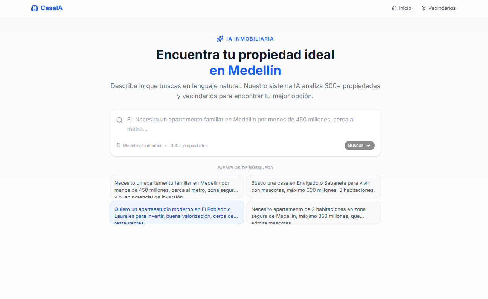
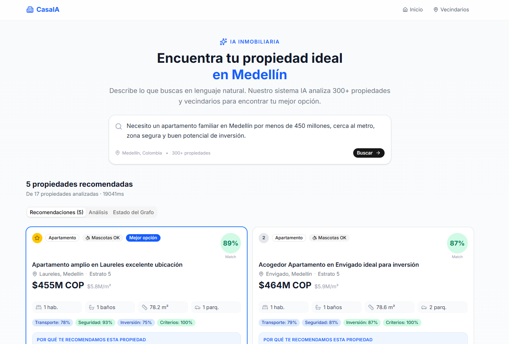
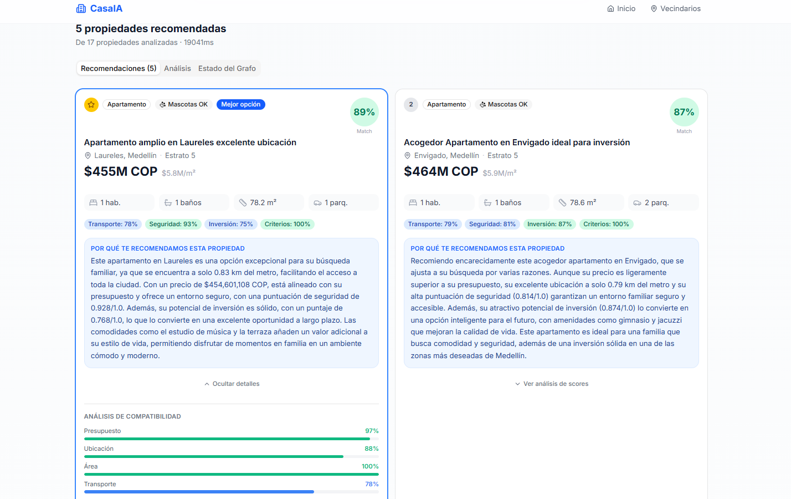
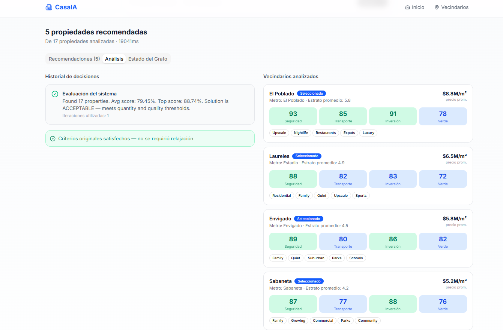

# CasaIA — Intelligent Housing Recommendation System

A full-stack AI-powered housing recommendation system for Medellín, Colombia.
Built with **LangGraph**, **FastAPI**, **GPT-4o-mini** (via OpenRouter), and **Next.js**.

---

## Screenshots

### Interfaz de búsqueda


### Recomendaciones con scores de compatibilidad


### Análisis detallado de compatibilidad


### Análisis de vecindarios y decisiones del grafo


---

## Architecture Overview

```
User Query (natural language)
        │
        ▼
┌─────────────────────────────────────────────────────────────────┐
│                    LangGraph Workflow                           │
│                                                                 │
│  ParsePreferences → AnalyzeZones → ExternalSignals              │
│        ↓                                                        │
│  RetrieveProperties → FilterProperties → ScoreProperties        │
│        ↓                                                        │
│  EvaluateResults ──acceptable──→ FinalRecommendation → END      │
│        │                                                        │
│        └─not acceptable─→ FailureDiagnosis                      │
│                                    ↓                            │
│                           RelaxConstraints ──loop back──┘       │
│                           (max 5 iterations)                    │
└─────────────────────────────────────────────────────────────────┘
        │
        ▼
   FastAPI Response (JSON)
        │
        ▼
   Next.js Frontend (Chat UI + Cards + Charts)
```

### LangGraph Nodes

| Node | Responsibility | Uses LLM? |
|------|---------------|-----------|
| `ParseUserPreferencesNode` | NL → structured criteria via GPT-4o-mini | ✅ |
| `AnalyzeZonesNode` | Score & select Medellín neighbourhoods | ❌ |
| `ExternalSignalsNode` | Load urban growth signals for zones | ❌ |
| `RetrievePropertiesNode` | Broad dataset query by criteria | ❌ |
| `FilterPropertiesNode` | Strict multi-criteria filter + dedup | ❌ |
| `ScorePropertiesNode` | Hybrid scoring + semantic embeddings | ❌ |
| `EvaluateResultsNode` | Accept if ≥3 props + avg score > 0.75 | ❌ |
| `FailureDiagnosisNode` | Diagnose why search failed | ✅ (fallback) |
| `RelaxConstraintsNode` | Progressive constraint relaxation | ❌ |
| `FinalRecommendationNode` | Generate personalised explanations | ✅ |

### Hybrid Scoring Formula

```
final_score = 0.30 × budget_score
            + 0.20 × location_score
            + 0.15 × area_score
            + 0.15 × transport_score
            + 0.10 × investment_score
            + 0.10 × semantic_similarity
```

Semantic similarity uses `sentence-transformers/all-MiniLM-L6-v2` (local, no API cost).

### Progressive Constraint Relaxation

| Level | Action |
|-------|--------|
| 1 | Budget +5% |
| 2 | Expand to adjacent neighbourhoods |
| 3 | Minimum area −15% |
| 4 | Metro distance threshold +50% |

---

## Project Structure

```
├── backend/
│   ├── app/
│   │   ├── config.py              # Settings (OpenRouter, thresholds)
│   │   ├── main.py                # FastAPI app + 4 endpoints
│   │   ├── graph/
│   │   │   ├── workflow.py        # LangGraph StateGraph definition
│   │   │   └── edges.py           # Conditional routing functions
│   │   ├── nodes/                 # One file per LangGraph node
│   │   │   ├── parse_preferences.py
│   │   │   ├── analyze_zones.py
│   │   │   ├── external_signals.py
│   │   │   ├── retrieve_properties.py
│   │   │   ├── filter_properties.py
│   │   │   ├── score_properties.py
│   │   │   ├── evaluate_results.py
│   │   │   ├── failure_diagnosis.py
│   │   │   ├── relax_constraints.py
│   │   │   └── final_recommendation.py
│   │   ├── models/
│   │   │   ├── state.py           # HousingState TypedDict
│   │   │   └── schemas.py         # Pydantic API schemas
│   │   ├── services/
│   │   │   ├── llm_service.py     # OpenRouter/LangChain wrapper
│   │   │   ├── embedding_service.py # sentence-transformers
│   │   │   └── data_service.py    # JSON dataset loader (cached)
│   │   ├── prompts/
│   │   │   └── templates.py       # All LLM prompt strings
│   │   └── utils/
│   │       ├── scoring.py         # Deterministic scoring formulas
│   │       └── logging.py         # Structured logger
│   ├── data/
│   │   ├── properties.json        # 300 Medellín properties
│   │   ├── neighborhoods.json     # 15 zones with scores
│   │   └── urban_signals.json     # 20 urban growth signals
│   ├── generate_data.py           # Mock data generator
│   └── requirements.txt
│
└── frontend/
    ├── app/
    │   ├── page.tsx               # Home + search + results
    │   ├── neighborhoods/page.tsx # Neighbourhood explorer
    │   └── property/[id]/page.tsx # Property detail
    ├── components/
    │   ├── SearchInterface.tsx    # NL query input + progress
    │   ├── RecommendationCard.tsx # Property card with scores
    │   ├── ScoreVisualization.tsx # Radar + bar charts
    │   ├── RelaxationHistory.tsx  # Timeline of relaxation steps
    │   ├── NeighborhoodInsights.tsx
    │   └── GraphStateDebug.tsx    # LangGraph pipeline debug view
    ├── lib/
    │   ├── api.ts                 # Typed API client
    │   └── types.ts               # Shared TypeScript types
    └── .env.local
```

---

## Quick Start

### Prerequisites

- Python 3.10+ with `pip`
- Node.js 18+
- An [OpenRouter](https://openrouter.io) API key (free tier works)

### 1. Backend

```bash
cd backend

# Copy and fill in your OpenRouter key
cp .env.example .env
# Edit .env: set OPENROUTER_API_KEY=sk-or-v1-...

# Install dependencies
pip install -r requirements.txt

# Generate mock data (already done if data/ files exist)
python generate_data.py

# Start the API server
uvicorn app.main:app --reload --port 8000
```

The API will be available at `http://localhost:8000`.
Interactive docs: `http://localhost:8000/docs`

### 2. Frontend

```bash
cd frontend
npm install
npm run dev
```

Open `http://localhost:3000` in your browser.

---

## API Reference

### `POST /recommendations`
Run the full LangGraph recommendation workflow.

**Request:**
```json
{
  "query": "Necesito un apartamento familiar en Medellín por menos de 450 millones, cerca al metro, zona segura."
}
```

**Response:** Ranked property recommendations with scores, explanations, relaxation history, and graph state summary.

### `GET /properties`
List properties with optional filtering.

**Query params:** `neighborhood_id`, `property_type`, `max_price`, `min_price`, `min_bedrooms`, `pet_friendly`, `limit`, `offset`

### `GET /neighborhoods`
Return all 15 Medellín zones with safety, transport, investment, and lifestyle scores.

### `GET /graph-state`
Return a debug summary of the last LangGraph execution (pipeline counts, zones, relaxation state).

---

## Environment Variables

| Variable | Description | Default |
|----------|-------------|---------|
| `OPENROUTER_API_KEY` | Your OpenRouter API key | Required |
| `OPENROUTER_BASE_URL` | OpenRouter endpoint | `https://openrouter.ai/api/v1` |
| `LLM_MODEL` | Model identifier | `openai/gpt-4o-mini` |
| `EMBEDDING_MODEL` | Sentence-transformers model | `all-MiniLM-L6-v2` |
| `MAX_ITERATIONS` | Max relaxation loops | `5` |
| `MIN_RECOMMENDATIONS` | Min props for acceptance | `3` |
| `MIN_AVERAGE_SCORE` | Min avg score threshold | `0.75` |
| `CORS_ORIGINS` | Allowed frontend origins | `http://localhost:3000` |

---

## Tech Stack

| Layer | Technology |
|-------|-----------|
| AI Orchestration | LangGraph 0.2+ |
| LLM | GPT-4o-mini via OpenRouter |
| Embeddings | sentence-transformers (local) |
| Backend | FastAPI + Python 3.10+ |
| Validation | Pydantic v2 |
| Frontend | Next.js 15 + TypeScript |
| Styling | TailwindCSS + shadcn/ui |
| Charts | Recharts |
