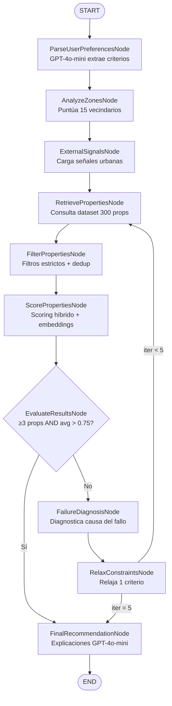

# CasaIA — Intelligent Housing Recommendation System

A full-stack AI-powered housing recommendation system for Medellín, Colombia.
Built with **LangGraph**, **FastAPI**, **GPT-4o-mini** (via OpenRouter), and **Next.js**.

---

## Screenshots

### Interfaz de búsqueda


### Recomendaciones con scores de compatibilidad


### Análisis detallado de compatibilidad


### Análisis de vecindarios y decisiones del grafo


---

## 1. Descripción de la Arquitectura del Sistema

El sistema está diseñado como un **pipeline de decisión multi-etapa** orquestado por LangGraph. La arquitectura separa deliberadamente la lógica determinista (filtros, scoring matemático, selección de zonas) del razonamiento semántico (LLM), aplicando IA únicamente donde agrega valor real.

```
Consulta del usuario (lenguaje natural)
        │
        ▼
┌─────────────────────────────────────────────────────────────────┐
│                    LangGraph Workflow                           │
│                                                                 │
│  ParsePreferences → AnalyzeZones → ExternalSignals              │
│        ↓                                                        │
│  RetrieveProperties → FilterProperties → ScoreProperties        │
│        ↓                                                        │
│  EvaluateResults ──aceptable──→ FinalRecommendation → END       │
│        │                                                        │
│        └─no aceptable─→ FailureDiagnosis                        │
│                                    ↓                            │
│                           RelaxConstraints ──loop back──┘       │
│                           (máx. 5 iteraciones)                  │
└─────────────────────────────────────────────────────────────────┘
        │
        ▼
   FastAPI Response (JSON)
        │
        ▼
   Next.js Frontend (Chat UI + Cards + Charts)
```

### Diagrama del Grafo (Mermaid)



---

## 2. Definición del Estado

El estado compartido `HousingState` es un `TypedDict` que fluye a través de todos los nodos. Cada nodo recibe el estado completo y retorna únicamente los campos que modifica.

```python
class HousingState(TypedDict):
    # ── Entrada ──────────────────────────────────────────────────
    user_query: str                      # Consulta original en lenguaje natural

    # ── Extracción de preferencias ───────────────────────────────
    original_criteria: UserCriteria      # Criterios iniciales (inmutable)
    current_criteria: UserCriteria       # Criterios activos (puede relajarse)
    extracted_preferences: Dict          # Salida cruda del LLM

    # ── Análisis de zonas ────────────────────────────────────────
    analyzed_zones: List[Dict]           # Todos los vecindarios con score
    selected_zones: List[str]            # IDs de zonas a buscar

    # ── Señales externas ─────────────────────────────────────────
    external_signals: List[Dict]         # Señales urbanas de zonas seleccionadas

    # ── Pipeline de propiedades ──────────────────────────────────
    raw_properties: List[Dict]           # Recuperadas del dataset
    filtered_properties: List[Dict]      # Tras filtros estrictos
    scored_properties: List[Dict]        # Con scores calculados

    # ── Evaluación e iteración ───────────────────────────────────
    recommendation_scores: Dict[str, float]  # prop_id → score final
    iteration_count: int                     # Iteraciones completadas
    relaxation_level: int                    # 0=ninguna, 4=máxima
    failure_reasons: List[str]               # Causas de fallo diagnosticadas
    decision_history: List[DecisionRecord]   # Trazabilidad completa
    is_solution_acceptable: bool             # Decisión del evaluador
    evaluator_feedback: str                  # Mensaje explicativo

    # ── Salida ───────────────────────────────────────────────────
    final_recommendations: List[Dict]    # Top-5 con explicaciones
    error_message: Optional[str]
```

**`UserCriteria`** — campos clave del objeto de criterios:

| Campo | Tipo | Descripción |
|---|---|---|
| `max_budget` | `float` | Presupuesto máximo en COP |
| `min_bedrooms` | `int` | Mínimo de habitaciones |
| `min_area_m2` | `float` | Área mínima en m² |
| `preferred_zones` | `List[str]` | IDs de vecindarios preferidos |
| `max_distance_to_metro_km` | `float` | Distancia máxima al metro |
| `pet_friendly` | `bool` | Requiere mascotas |
| `min_safety_score` | `float` | Score mínimo de seguridad [0–1] |
| `lifestyle_tags` | `List[str]` | Etiquetas de estilo de vida |

---

## 3. Descripción de Actividades e Implementación

### Nodo 1 — `ParseUserPreferencesNode`
**Entrada:** `user_query` (texto libre)  
**Salida:** `original_criteria`, `current_criteria`, `extracted_preferences`

Usa GPT-4o-mini con **structured output** de LangChain (Pydantic schema) para transformar lenguaje natural en un objeto `UserCriteria` validado. El prompt incluye reglas explícitas: conversión de "450 millones" → `450_000_000`, IDs exactos de vecindarios, e inferencia del presupuesto mínimo como 60% del máximo cuando no se especifica.

### Nodo 2 — `AnalyzeZonesNode`
**Entrada:** `current_criteria`  
**Salida:** `analyzed_zones`, `selected_zones`

Puntúa deterministamente los 15 vecindarios con una función de compatibilidad ponderada:
- Seguridad (30%) · Transporte (25%) · Inversión (20%) · Estilo de vida (15%) · Precio (10%)

Selecciona las zonas con score ≥ 0.45, siempre incluyendo las zonas preferidas por el usuario.

### Nodo 3 — `ExternalSignalsNode`
**Entrada:** `selected_zones`  
**Salida:** `external_signals`

Carga las señales urbanas (proyectos de infraestructura, crecimiento, alertas) asociadas a las zonas seleccionadas. Cada señal incluye `urban_growth_score`, tipo de impacto (positivo/negativo/neutral) y estimación del impacto en valor de la propiedad.

### Nodo 4 — `RetrievePropertiesNode`
**Entrada:** `current_criteria`, `selected_zones`  
**Salida:** `raw_properties`

Consulta el dataset de 300 propiedades con márgenes generosos (130% del presupuesto, −1 habitación) para maximizar el recall antes del filtro estricto.

### Nodo 5 — `FilterPropertiesNode`
**Entrada:** `raw_properties`, `current_criteria`  
**Salida:** `filtered_properties`

Aplica filtros estrictos con tolerancias pequeñas: presupuesto (+5%), área (−10%), distancia al metro (+20%), seguridad (−10%). Elimina duplicados por ID.

### Nodo 6 — `ScorePropertiesNode`
**Entrada:** `filtered_properties`, `analyzed_zones`, `external_signals`  
**Salida:** `scored_properties`, `recommendation_scores`

Calcula el **score híbrido** para cada propiedad:

```
final_score = 0.30 × budget_score        (proximidad al 80% del presupuesto)
            + 0.20 × location_score      (seguridad + compatibilidad de zona)
            + 0.15 × area_score          (cumplimiento del área mínima)
            + 0.15 × transport_score     (inverso de distancia al metro)
            + 0.10 × investment_score    (score propiedad + señales urbanas)
            + 0.10 × semantic_score      (cosine similarity con embeddings locales)
```

La similitud semántica usa `sentence-transformers/all-MiniLM-L6-v2` (modelo local, sin costo de API).

### Nodo 7 — `EvaluateResultsNode`
**Entrada:** `scored_properties`, `iteration_count`  
**Salida:** `is_solution_acceptable`, `evaluator_feedback`

**Criterios de aceptación:**
- Cantidad: al menos 3 propiedades puntuadas
- Calidad: score promedio > 0.75

Si `iteration_count >= MAX_ITERATIONS`, fuerza aceptación para evitar bucles infinitos.

### Nodo 8 — `FailureDiagnosisNode`
**Entrada:** `current_criteria`, conteos del pipeline  
**Salida:** `failure_reasons`

Diagnostica la causa principal del fallo usando GPT-4o-mini con fallback a reglas deterministas. Posibles diagnósticos: `BUDGET_TOO_LOW`, `AREA_TOO_RESTRICTIVE`, `LOCATION_TOO_SPECIFIC`, `TRANSPORT_TOO_STRICT`, `INCOMPATIBLE_CONSTRAINTS`.

### Nodo 9 — `RelaxConstraintsNode`
**Entrada:** `current_criteria`, `relaxation_level`, `analyzed_zones`  
**Salida:** `current_criteria` (modificado), `relaxation_level`, `decision_history`

Relaja **un único criterio por iteración** siguiendo un orden predefinido (ver sección 4). Registra cada cambio en `decision_history` con valor anterior, nuevo valor y justificación.

### Nodo 10 — `FinalRecommendationNode`
**Entrada:** `scored_properties`, `user_query`, `current_criteria`  
**Salida:** `final_recommendations`

Toma el Top-5 de propiedades puntuadas y genera una explicación personalizada por propiedad usando GPT-4o-mini (máx. 3 concurrentes). Calcula también el porcentaje de criterios originales satisfechos por cada propiedad.

---

## 4. Estrategia de Relajación de Condiciones

Cuando el evaluador rechaza los resultados, el sistema activa el bucle de relajación progresiva. El principio clave es **modificar un solo criterio por iteración** para mantener trazabilidad y evitar cambios drásticos.

### Orden y justificación

| Nivel | Criterio relajado | Cambio | Justificación |
|-------|-----------------|--------|---------------|
| **1** | Presupuesto máximo | +5% | El criterio más frecuentemente limitante; una variación pequeña no cambia el perfil del comprador |
| **2** | Zonas de búsqueda | Expande a vecindarios adyacentes | Amplía el mercado sin abandonar la zona deseada |
| **3** | Área mínima | −15% | Sacrifica espacio antes que ubicación o precio |
| **4** | Distancia al metro | +50% | El transporte es importante pero hay alternativas de bus |

### Mapa de adyacencia de zonas

Cuando se activa el nivel 2, el sistema expande usando un mapa de vecindarios limítrofes:

```
El Poblado     → Envigado, Laureles, El Estadio
Laureles       → El Estadio, La Floresta, La América, Belén
Envigado       → El Poblado, Sabaneta, Itagüí
```

### Condición de parada

El bucle se detiene cuando:
1. `is_solution_acceptable = True` (criterios de calidad cumplidos), **o**
2. `iteration_count >= 5` (límite máximo alcanzado — retorna el mejor resultado disponible)

---

## 5. Ejemplo de Ejecución

### Consulta de entrada
```
"Necesito un apartamento familiar en Medellín por menos de 450 millones,
cerca al metro, zona segura y buen potencial de inversión."
```

### Traza del grafo

**Iteración 1:**

```
ParseUserPreferencesNode
  → max_budget: 450_000_000 COP
  → min_bedrooms: 2
  → max_distance_to_metro_km: 1.5
  → min_safety_score: 0.75
  → lifestyle_tags: ["family"]

AnalyzeZonesNode
  → Zonas seleccionadas (score ≥ 0.45):
    envigado (0.82), sabaneta (0.79), floresta (0.76),
    belen (0.71), laureles (0.68), san_antonio_prado (0.61)

ExternalSignalsNode
  → 8 señales cargadas (metro extension Envigado-Sabaneta,
    tech district Envigado, overflow demand Floresta...)

RetrievePropertiesNode
  → 61 propiedades candidatas de 300 totales

FilterPropertiesNode
  → 21 propiedades tras filtros estrictos

ScorePropertiesNode
  → Top 3:
    prop_0042 — Apartamento en Laureles     → score: 0.8981
    prop_0187 — Apartamento en Envigado     → score: 0.8740
    prop_0093 — Apartamento en Sabaneta     → score: 0.8612

EvaluateResultsNode
  → n=21, avg_score=0.7843, top_score=0.8981
  → ACEPTABLE ✓ (≥3 props AND 0.7843 > 0.75)
  → Sin necesidad de relajación
```

**FinalRecommendationNode:** genera 5 explicaciones personalizadas en español.

### Respuesta final (resumen)
```json
{
  "status": "success",
  "total_found": 21,
  "iterations_used": 1,
  "relaxation_applied": false,
  "recommendations": [
    {
      "rank": 1,
      "property": { "title": "Apartamento amplio en Laureles...", "price": 454601108 },
      "scores": { "final_score": 0.8981, "budget_score": 0.97, "location_score": 0.88 },
      "criteria_satisfaction_pct": 1.0,
      "explanation": "Este apartamento en Laureles es una opción excepcional..."
    }
  ]
}
```

### Escenario con relajación (presupuesto muy ajustado)

Si el usuario busca con `max_budget: 200_000_000` y `min_bedrooms: 3` en El Poblado:

```
Iteración 1: 0 props → RECHAZADO
  FailureDiagnosis: BUDGET_TOO_LOW
  RelaxConstraints L1: budget 200M → 210M (+5%)

Iteración 2: 1 prop → RECHAZADO
  FailureDiagnosis: LOCATION_TOO_SPECIFIC
  RelaxConstraints L2: zonas expandidas (el_estadio, laureles añadidos)

Iteración 3: 4 props, avg=0.71 → RECHAZADO (calidad insuficiente)
  FailureDiagnosis: BUDGET_TOO_LOW
  RelaxConstraints L3: min_area 80m² → 68m²

Iteración 4: 7 props, avg=0.77 → ACEPTADO ✓
  Retorna resultados con historial de 3 relajaciones
```

---

## 6. Reflexión Crítica

### Fortalezas del diseño

**Separación de responsabilidades:** El uso de nodos especializados en LangGraph facilita el mantenimiento y pruebas unitarias. Cada nodo puede evolucionar independientemente sin afectar el resto del pipeline.

**LLM solo donde aporta valor:** El 80% del procesamiento es determinista (scoring matemático, filtros, selección de zonas). El LLM se usa únicamente para parseo semántico de consultas y generación de explicaciones en lenguaje natural — las tareas donde realmente supera a la lógica programática.

**Trazabilidad completa:** El `decision_history` registra cada relajación con valor anterior/nuevo y justificación, lo que permite explicar al usuario exactamente por qué sus criterios originales no se cumplieron.

### Limitaciones identificadas

**Dataset sintético:** Las 300 propiedades fueron generadas con datos realistas pero ficticios. En producción, el sistema requeriría integración con APIs de portales inmobiliarios colombianos (Finca Raíz, MetroCuadrado) y actualización periódica del dataset.

**Embeddings desconectados del dominio:** El modelo `all-MiniLM-L6-v2` es de propósito general. Un modelo fine-tuneado en descripciones inmobiliarias colombianas produciría mejores similitudes semánticas.

**Scoring sin retroalimentación:** El sistema no aprende de las decisiones del usuario. Integrar un mecanismo de feedback (propiedades marcadas como "interesantes") permitiría personalizar los pesos del scoring con el tiempo.

**Latencia en primera carga:** La descarga del modelo de embeddings (~90MB) en el primer arranque genera una demora de ~30s. En producción se resolvería pre-cargando el modelo en el contenedor Docker.

**Relajación unidimensional:** La estrategia actual modifica un criterio a la vez de forma predefinida. Un enfoque más sofisticado podría usar el diagnóstico del LLM para elegir dinámicamente qué criterio relajar según la causa específica del fallo.

### Decisiones de diseño relevantes

| Decisión | Alternativa descartada | Razón |
|---|---|---|
| Nodos separados por responsabilidad | Agente único autónomo | Mayor control, depuración y trazabilidad |
| Embeddings locales | API de embeddings OpenAI | Sin costo adicional, sin latencia de red, reproducibilidad |
| Relajación ordenada fija | LLM decide qué relajar | Comportamiento predecible y auditable |
| JSON datasets | Base de datos SQL | Simplicidad en demo; fácil de extender a BD real |

---

## Project Structure

```
├── backend/
│   ├── app/
│   │   ├── config.py              # Settings (OpenRouter, thresholds)
│   │   ├── main.py                # FastAPI app + 4 endpoints
│   │   ├── graph/
│   │   │   ├── workflow.py        # LangGraph StateGraph definition
│   │   │   └── edges.py           # Conditional routing functions
│   │   ├── nodes/                 # One file per LangGraph node
│   │   │   ├── parse_preferences.py
│   │   │   ├── analyze_zones.py
│   │   │   ├── external_signals.py
│   │   │   ├── retrieve_properties.py
│   │   │   ├── filter_properties.py
│   │   │   ├── score_properties.py
│   │   │   ├── evaluate_results.py
│   │   │   ├── failure_diagnosis.py
│   │   │   ├── relax_constraints.py
│   │   │   └── final_recommendation.py
│   │   ├── models/
│   │   │   ├── state.py           # HousingState TypedDict
│   │   │   └── schemas.py         # Pydantic API schemas
│   │   ├── services/
│   │   │   ├── llm_service.py     # OpenRouter/LangChain wrapper
│   │   │   ├── embedding_service.py # sentence-transformers
│   │   │   └── data_service.py    # JSON dataset loader (cached)
│   │   ├── prompts/
│   │   │   └── templates.py       # All LLM prompt strings
│   │   └── utils/
│   │       ├── scoring.py         # Deterministic scoring formulas
│   │       └── logging.py         # Structured logger
│   ├── data/
│   │   ├── properties.json        # 300 Medellín properties
│   │   ├── neighborhoods.json     # 15 zones with scores
│   │   └── urban_signals.json     # 20 urban growth signals
│   ├── generate_data.py           # Mock data generator
│   └── requirements.txt
│
└── frontend/
    ├── app/
    │   ├── page.tsx               # Home + search + results
    │   ├── neighborhoods/page.tsx # Neighbourhood explorer
    │   └── property/[id]/page.tsx # Property detail
    ├── components/
    │   ├── SearchInterface.tsx    # NL query input + progress
    │   ├── RecommendationCard.tsx # Property card with scores
    │   ├── ScoreVisualization.tsx # Radar + bar charts
    │   ├── RelaxationHistory.tsx  # Timeline of relaxation steps
    │   ├── NeighborhoodInsights.tsx
    │   └── GraphStateDebug.tsx    # LangGraph pipeline debug view
    ├── lib/
    │   ├── api.ts                 # Typed API client
    │   └── types.ts               # Shared TypeScript types
    └── .env.local
```

---

## Quick Start

### Prerequisites

- Python 3.10+ with `pip`
- Node.js 18+
- An [OpenRouter](https://openrouter.io) API key (free tier works)

### 1. Backend

```bash
cd backend

# Copy and fill in your OpenRouter key
cp .env.example .env
# Edit .env: set OPENROUTER_API_KEY=sk-or-v1-...

# Install dependencies
pip install -r requirements.txt

# Generate mock data (already done if data/ files exist)
python generate_data.py

# Start the API server
uvicorn app.main:app --reload --port 8000
```

The API will be available at `http://localhost:8000`.
Interactive docs: `http://localhost:8000/docs`

### 2. Frontend

```bash
cd frontend
npm install
npm run dev
```

Open `http://localhost:3000` in your browser.

---

## API Reference

### `POST /recommendations`
Run the full LangGraph recommendation workflow.

**Request:**
```json
{
  "query": "Necesito un apartamento familiar en Medellín por menos de 450 millones, cerca al metro, zona segura."
}
```

**Response:** Ranked property recommendations with scores, explanations, relaxation history, and graph state summary.

### `GET /properties`
List properties with optional filtering.

**Query params:** `neighborhood_id`, `property_type`, `max_price`, `min_price`, `min_bedrooms`, `pet_friendly`, `limit`, `offset`

### `GET /neighborhoods`
Return all 15 Medellín zones with safety, transport, investment, and lifestyle scores.

### `GET /graph-state`
Return a debug summary of the last LangGraph execution (pipeline counts, zones, relaxation state).

---

## Environment Variables

| Variable | Description | Default |
|----------|-------------|---------|
| `OPENROUTER_API_KEY` | Your OpenRouter API key | Required |
| `OPENROUTER_BASE_URL` | OpenRouter endpoint | `https://openrouter.ai/api/v1` |
| `LLM_MODEL` | Model identifier | `openai/gpt-4o-mini` |
| `EMBEDDING_MODEL` | Sentence-transformers model | `all-MiniLM-L6-v2` |
| `MAX_ITERATIONS` | Max relaxation loops | `5` |
| `MIN_RECOMMENDATIONS` | Min props for acceptance | `3` |
| `MIN_AVERAGE_SCORE` | Min avg score threshold | `0.75` |
| `CORS_ORIGINS` | Allowed frontend origins | `http://localhost:3000` |

---

## Tech Stack

| Layer | Technology |
|-------|-----------|
| AI Orchestration | LangGraph 0.2+ |
| LLM | GPT-4o-mini via OpenRouter |
| Embeddings | sentence-transformers (local) |
| Backend | FastAPI + Python 3.10+ |
| Validation | Pydantic v2 |
| Frontend | Next.js 15 + TypeScript |
| Styling | TailwindCSS + shadcn/ui |
| Charts | Recharts |
